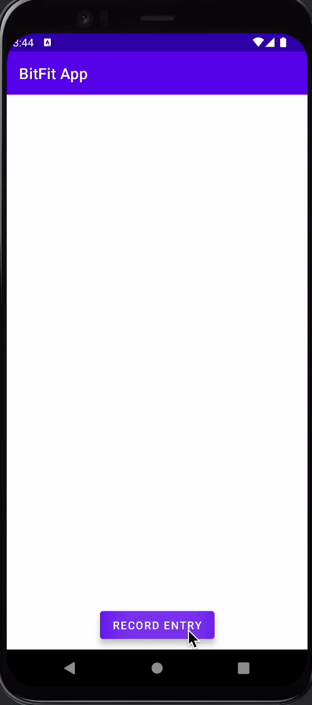

# Android Project 5 - *BitFit Part 1*

Submitted by: **Mahdi Ali-Raihan**

**BitFit** is a health metrics app that allows users to create diary entries with a title, date, mood, and description of entry.

Time spent: **10** hours spent in total

## Required Features

The following **required** functionality is completed:

- [X] **At least one health metric is tracked (based on user input)**
  - Chosen metric(s): `[Diary Entries, Mood]`
- [X] **There is a "create entry" UI that prompts users to make their daily entry**
- [X] **New entries are saved in a database and then updated in the RecyclerView**
- [X] **On application restart, previously entered entries are preserved (i.e., are *persistent*)**
 
The following **optional** features are implemented:

- [ ] **Create a UI for tracking averages and trends in metrics**
- [ ] **Improve and customize the user interface through styling and coloring**
- [ ] **Implement orientation responsivity**
- [ ] **Add a daily photo feature**

The following **additional** features are implemented:

- [ ] List anything else that you can get done to improve the app functionality!

## Video Walkthrough

Here's a walkthrough of implemented user stories:

<!-- Replace this with whatever GIF tool you used! -->
GIF created with Ezgif
<!-- Recommended tools:
[Kap](https://getkap.co/) for macOS
[ScreenToGif](https://www.screentogif.com/) for Windows
[peek](https://github.com/phw/peek) for Linux. -->

## Notes

Describe any challenges encountered while building the app.

Two major challenges I had was dealing with passing the result data from the second activity to the main activity. The other challenge I had was storing that data to the database and making sure that it persists after I reload the app.

## License

    Copyright [2022] [Mahdi Ali-Raihan]

    Licensed under the Apache License, Version 2.0 (the "License");
    you may not use this file except in compliance with the License.
    You may obtain a copy of the License at

        http://www.apache.org/licenses/LICENSE-2.0

    Unless required by applicable law or agreed to in writing, software
    distributed under the License is distributed on an "AS IS" BASIS,
    WITHOUT WARRANTIES OR CONDITIONS OF ANY KIND, either express or implied.
    See the License for the specific language governing permissions and
    limitations under the License.
